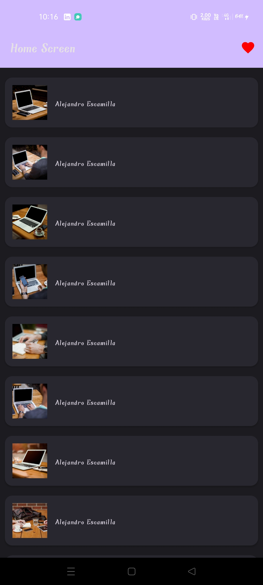
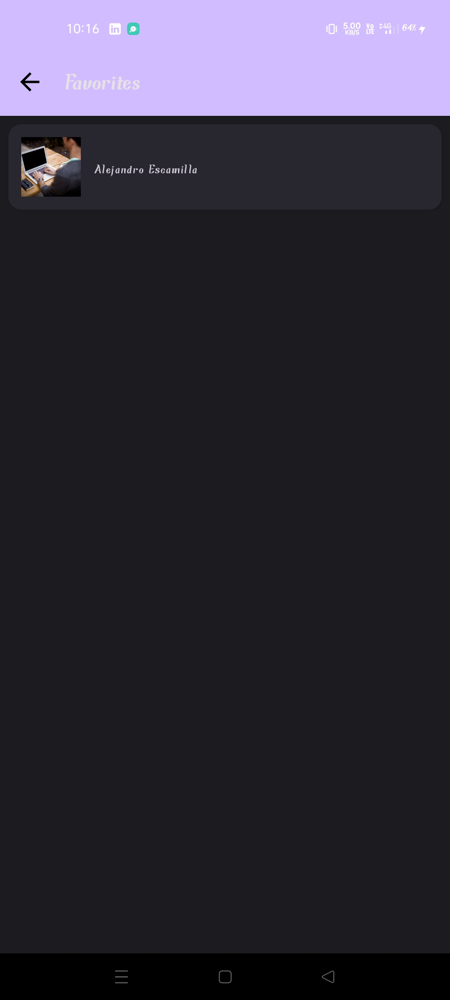

# Quotes Browser App

## Overview
Quotes Browser App is an Android app built with Kotlin.  
It fetches random images and authors from the Picsum API and allows users to mark favorites.

**Features:**
- Display a list of quotes with images
- Navigate to detail screen to view full image and author
- Add/remove favorites
- Favorites stored locally using SharedPreferences
- Top App Bar with navigation and favorites option

## Screenshots / Screen Recording

## Navigation & Argument Handling
- **HomeFragment** → displays list of images and authors
- **DetailFragment** → shows selected quote image and author; allows adding to favorites
- **FavoritesFragment** → shows locally saved favorite items
- Navigation uses **SafeArgs** to pass `quoteAuthor` and `quoteImage` arguments between fragments.

## How to Run
1. Open the project in Android Studio
2. Sync Gradle
3. Run the app on an emulator or real device
4. Internet connection is required to fetch images from the Picsum API

## Notes
- Favorites are stored locally using SharedPreferences
- Retrofit is used for API calls
- Jetpack Navigation Component is used for fragment navigation
- Material 3 is used for UI components
